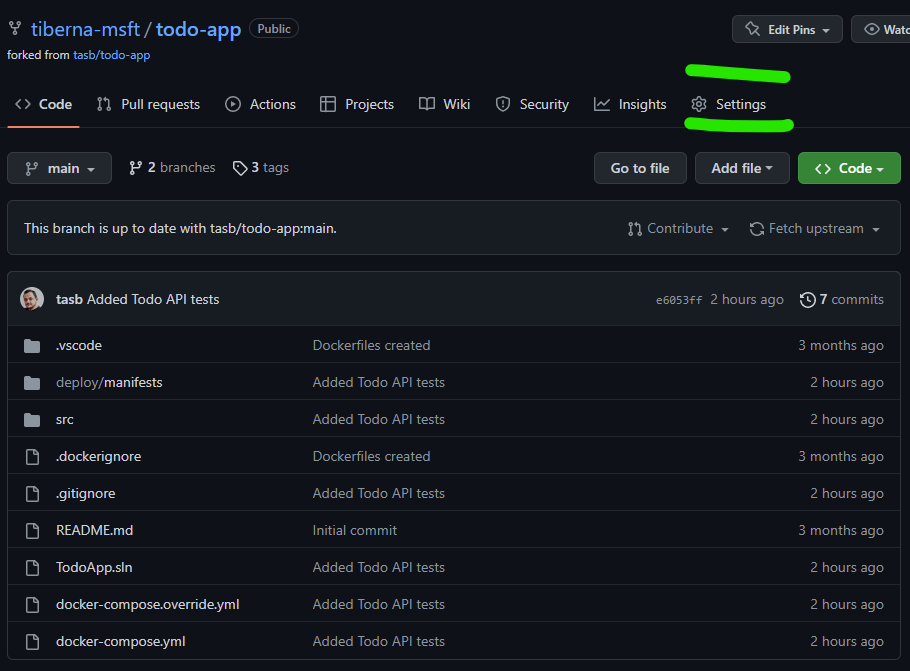
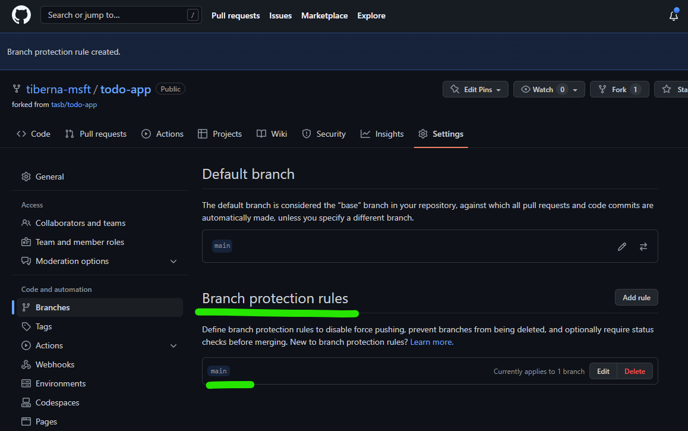

# Lab 07 - Use Terraform on CI/CD

## Table of Contents

- [Learning Objectives](#learning-objectives)
- [Pre-requisites](#pre-requisites)
- [Guide](#guide)
  - [Step 01: Configure your repo](#step-01-configure-your-repo)
  - [Step 02: Define workload identity with Azure](#step-02-define-workload-identity-with-azure)
  - [Step 03: Add Secrets to your repo](#step-03-add-secrets-to-your-repo)
  - [Step 04: Create the Pull Request workflow](#step-04-create-the-pull-request-workflow)
  - [Step 05: Check Checkov results](#step-05-check-checkov-results)
  - [Step 06: Check Terraform Plan output](#step-06-check-terraform-plan-output)
- [Conclusion](#conclusion)

## Learning Objectives

- Learn how to create a Pull Request workflow on GitHub Actions
- Learn how to use Checkov on GitHub Actions
- Learn how to use Terraform on GitHub Actions

## Pre-requisites

- Have finished [Lab 06](lab06.md) and having your modules ready
- Alternatively, you can use the code from [Demo 07](../demos/demo07)
- Make sure that the code you'll use is on main branch of your repository
- Install Azure CLI on your machine following the instructions on [this link](https://docs.microsoft.com/en-us/cli/azure/install-azure-cli)

## Guide

### Step 01: Configure your repo

Before starting change your repo, let's add some policies to enforce Pull Requests on `main` branch and enable Issues on your repo.

Click on `Settings` option on tool bar as shown on next image.



On main screen, check the `Issues` option to enable GitHub Issues on your repo.


Next navigate to `Branches` option available on the left side option, under block `Code and Automation`. On that screen click on `Add classic branch protection rule` button as shown on next image.


On new screen, add `main`on `Branch name pattern`. This option will enable this policy on `main` branch, meaning that all merges (updates) on that branch must came from a Pull Request.

You need to enable the option `Require a pull request before merging` to enable the policy. You need to **disable** `Required approvals` option, since you're the only user on that repo and by default, GitHub don't allow that the creator of a pull request can approve his own changes.

At the end, your rule must have the following details.


After making this configuration, you need to click on `Create` green button on the bottom of this page. You may need to enter again your password to confirm this change. After you do that you must see a similar screen like the one below.



Now you're repo is ready to receive the first workflow.

### Step 02: Define workload identity with Azure

Before creating the workflow, you need to create a Service Principal on Azure to allow GitHub Actions to interact with Azure.

On your machine, run the following command to login on Azure:

```bash
az login
```

And follow the instructions to login on Azure.

Then, run the following command to create a Service Principal:

```bash
az ad sp create-for-rbac --name "GitHubActions_<your_name>" --role contributor --scopes /subscriptions/<your-subscription-id>
```

Replace `<your_name>` with your name and `<your-subscription-id>` with your subscription ID.

This command will return a JSON with the Service Principal information. Save this information, you'll need it later.

Now create a JSON file named `policy_main.json` and add the following content on it:

```json
{
  "name": "gh-repo-main",
  "issuer": "https://token.actions.githubusercontent.com",
  "subject": "repo:<GH-USERNAME>/<GH-REPO>:ref:refs/heads/main",
  "audiences": [
    "api://AzureADTokenExchange"
  ]
}
```

Then, create a JSON file name `policy_pr.json` and add the following content on it:

```json
{
  "name": "gh-repo-pr",
  "issuer": "https://token.actions.githubusercontent.com",
  "subject": "repo:<GH-USERNAME>/<GH-REPO>:pull_request",
  "audiences": [
    "api://AzureADTokenExchange"
  ]
}
```

On the file you should replace the following placeholders:

- GH-USERNAME, with your GitHub username
- GH-REPO, with your GitHub repository name

The first policy is to allow the Service Principal to access the repository on the `main` branch and the second policy is to allow the Service Principal to access the repository on the Pull Request.

Run the following command to create the federated credential for the Service Principal:

```bash
az ad app federated-credential create --id <OBJECT_ID> --parameters @policy_main.json
az ad app federated-credential create --id <OBJECT_ID> --parameters @policy_pr.json
```

The `<OBJECT_ID>` is the `appId` from the Service Principal JSON.

### Step 03: Add Secrets to your repo

Now, you need to add the Service Principal information as secrets on your repo.

Navigate to your repo on GitHub and click on `Settings` on the toolbar.

Then, click on `Secrets and variables` on the left side menu and then click on `Actions`.

Now you click on `New repository secret` and add the following secrets:

- `AZURE_SUBSCRIPTION_ID`: The `subscriptionId` from the Service Principal JSON
- `AZURE_TENANT_ID`: The `tenant` from the Service Principal JSON
- `AZURE_CLIENT_ID`: The `appId` from the Service Principal JSON

Finally, create a new secret to store database password:

- `DB_PASSWORD`: The password you want to use for the database

### Step 04: Create the Pull Request workflow

First, you need to create a new branch on your repo.

On your machine run the following command to create a new branch:

```bash
git checkout -b feature/add-pr-workflow
```

Now, create a new file on `.github/workflows` folder with the name `pull_request.yml` and add the following content:

```yaml
name: Pull Request Workflow

on:
  pull_request:
    branches:
      - main

jobs:
  validate-and-scan:
    runs-on: ubuntu-latest

    steps:
    - name: Checkout code
      uses: actions/checkout@v2

    - name: Setup Terraform
      uses: hashicorp/setup-terraform@v1
      with:
        terraform_version: 1.10.2

    - name: Terraform Init
      run: terraform init

    - name: Terraform Validate
      run: terraform validate

    - name: Checkov GitHub Action
      uses: bridgecrewio/checkov-action@v12
      with:
        output_format: cli, json
        output_file_path: console,results.json
        directory: <your_directory>

    - name: Publish security report to artifact
      if: always()
      uses: actions/upload-artifact@v4
      with:
        name: checkov-report
        path: results.json

  plan:
    runs-on: ubuntu-latest
    needs: validate-and-scan
    permissions:
      id-token: write # Require write permission to Fetch an OIDC token.
      contents: read

    steps:
    - name: Checkout code
      uses: actions/checkout@v2

    - name: Setup Terraform
      uses: hashicorp/setup-terraform@v1
      with:
        terraform_version: 1.10.2

    - name: Azure CLI Login
      uses: azure/login@v2
      with:
        client-id: ${{ secrets.AZURE_CLIENT_ID }}
        tenant-id: ${{ secrets.AZURE_TENANT_ID }}
        subscription-id: ${{ secrets.AZURE_SUBSCRIPTION_ID }}
    
    - name: Terraform Init
      run: terraform init

    - name: Terraform Plan
      run: terraform plan -var=db_password=${{ secrets.DB_PASSWORD }} -var=prefix=<your_prefix> -out ./infraPlan

    - name: Post PR comment
      uses: borchero/terraform-plan-comment@v2
      with:
        token: ${{ github.token }}
        planfile: ./infraPlan

    - name: Upload plan
      uses: actions/upload-artifact@v4
      with:
        name: plan
        path: ./infraPlan
```

Please replace `<your_directory>` with the directory where your Terraform code is located and `<your_prefix>` with the prefix you are using on your resources.

Now you can commit and push the changes to your repo:

```bash
git add .github/workflows/pull_request.yml
git commit -m "Add Pull Request workflow"
git push origin feature/add-pr-workflow
```

After pushing the changes, you can create a Pull Request on GitHub.

As soon as you create the Pull Request, the workflow will start running.

### Step 05: Check Checkov results

Please review the log of checkov action to see the list of errors you get on your code.

In a real scenario, you should fix the errors before merging the Pull Request or you should add a parameter on checkov action to not evaluate specific rules.

For now, we will ignore the errors and continue the pull request.

Edit the workflow file `pull_request.yml` and add the following line to the `Checkov GitHub Action` step, before the `uses` parameter:

```yaml
continue-on-error: true
```

Please pay attention to the indentation of the line.

Now, commit and push the changes to your branch:

```bash
git commit -a -m "Ignore checkov errors"
git push origin feature/add-pr-workflow
```

Now your workflow will run again.

### Step 06: Check Terraform Plan output

When the workflow finishes, you can check the output of the Terraform Plan.

You can check it on the log of the workflow, you can download the artifact or you can check the comment on the Pull Request.

The action `Post PR comment` will post a comment on the Pull Request with the output of the Terraform Plan.

This is a good option for you to take a decision about proceed with the merge or not.

## Conclusion

In this lab, you have learned how to create a Pull Request workflow on GitHub Actions to validate and plan your Terraform code.
